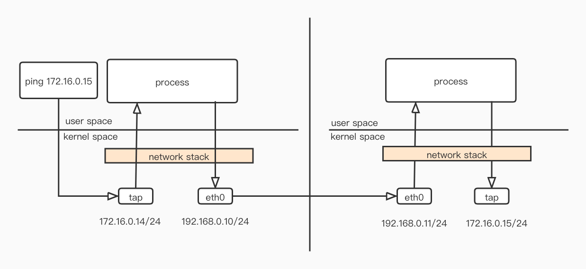

## tap-demo

this a tap device demo. it create a tap device and listen on a UDP port.

it will send data to tap device when receive data from UDP port. And it will send data to remote UDP endpoint when receive data from tap device.

following graph show how it works




## build

```shell
make build
```

## run

```shell
# host: 192.168.0.10
$ sudo ./tap-demo -addr 172.16.0.14/24 -laddr 192.168.0.10 -lport=30000 -raddr=192.168.0.11 -rport=30001
```

```shell
# host: 192.168.0.11
$ sudo ./tap-demo -addr 172.16.0.15/24 -laddr 192.168.0.11 -lport=30001 -raddr=192.168.0.10 -rport=30001
```

```shell
# host: 192.168.0.10
$ ping 172.16.0.15
PING 172.16.0.15 (172.16.0.15) 56(84) bytes of data.
64 bytes from 172.16.0.15: icmp_seq=1 ttl=64 time=1.14 ms
64 bytes from 172.16.0.15: icmp_seq=2 ttl=64 time=0.891 ms
64 bytes from 172.16.0.15: icmp_seq=3 ttl=64 time=0.716 ms
```
